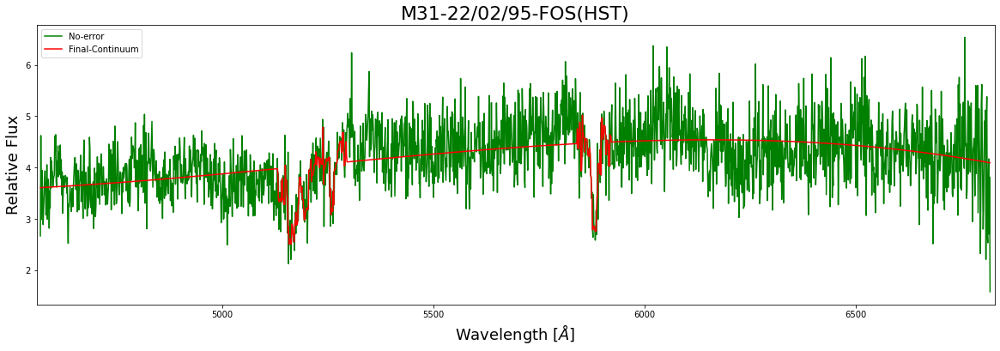

# M31 Spectra Analysis

Spectral Data from the central region of M31 in the optical wavelength was analysed and fitted. Properties, contents and type of Stars present in the region was derived from the fitted data.

[Youtube](https://youtu.be/ChSKIlgKt3g) link of the talk.

